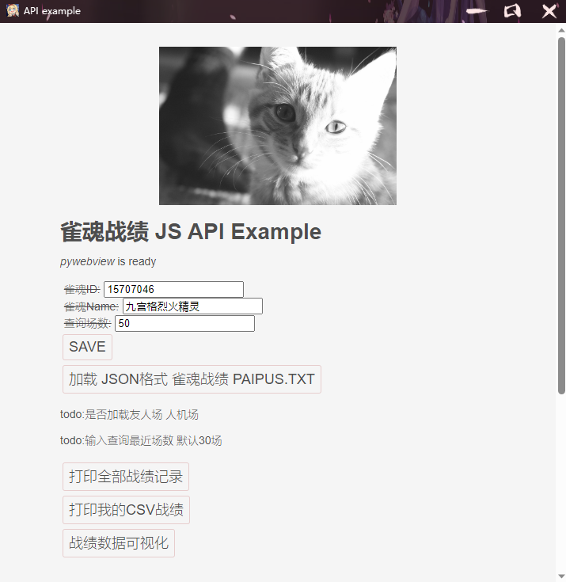
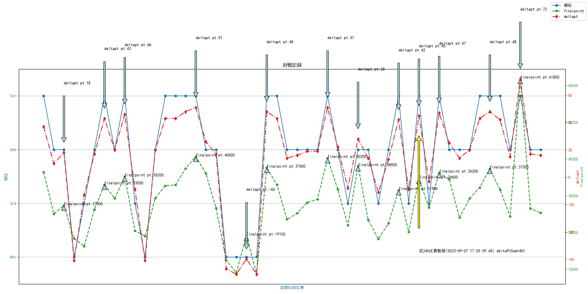
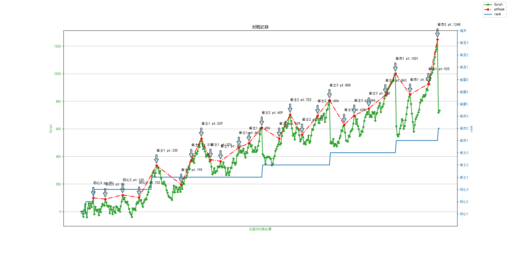

# majSoulRecordPrint
 雀魂战绩数据可视化

>此应用依赖 [雀魂牌谱分析工具](https://github.com/zyr17/MajsoulPaipuAnalyzer) 项目生成的雀魂战绩`json`文件

## 使用方法
- [] 使用此应用先到[雀魂牌谱分析工具软件发布页](https://github.com/zyr17/MajsoulPaipuAnalyzer/releases/)下载工具软件
- [] 使用工具软件登录雀魂以后 点击工具栏获取牌谱跟下载牌谱
- [] 运行本项目执行文件就OK了

## 界面

## 开发者调试环境

- [] 环境: windows python3 pipenv Pyinstaller
- 