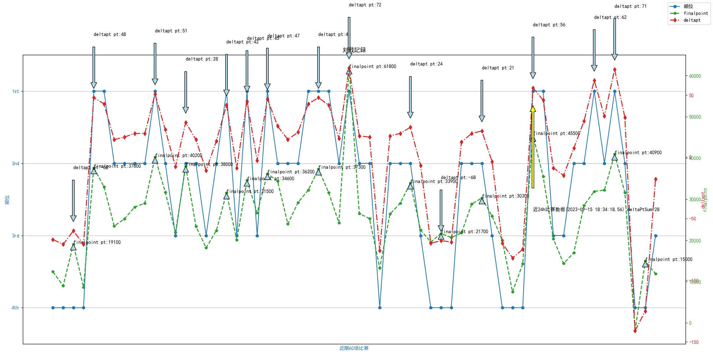
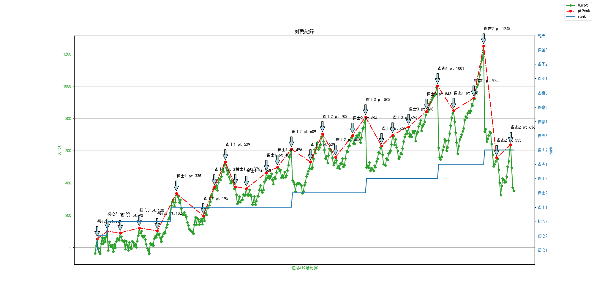

# majSoulRecordPrint
 雀魂战绩数据可视化

## ⭐ Stargazers

Many thanks to the kind individuals who leave a star.
Your support is much appreciated!

## 使用方法

- [ ] 运行 - 登录 - 获取牌谱

## 界面

## 开发者调试环境

Windows: 

- [ ] 环境: windows python3 pipenv Pyinstaller

## 免责声明
该工具为个人制作，未对雀魂代码逻辑进行改动，但是为了获取牌谱数据使用了极少量前端代码的API，包括**获取用户牌谱列表**。所有相关操作代码均在[browseinject.js](assets/browseinject.js)中，工具不会代替用户执行任何其他交互性操作。请自行判断使用该工具的风险。如果使用该工具或（不存在的）该工具的衍生物产生的一切后果作者均不会承担任何责任。

## 致谢

该项目使用或曾经使用了这些项目的资源，感谢他们。

- [雀魂牌谱分析工具](https://github.com/zyr17/MajsoulPaipuAnalyzer)
- [pywebview](https://github.com/r0x0r/pywebview/)

## 贡献者
