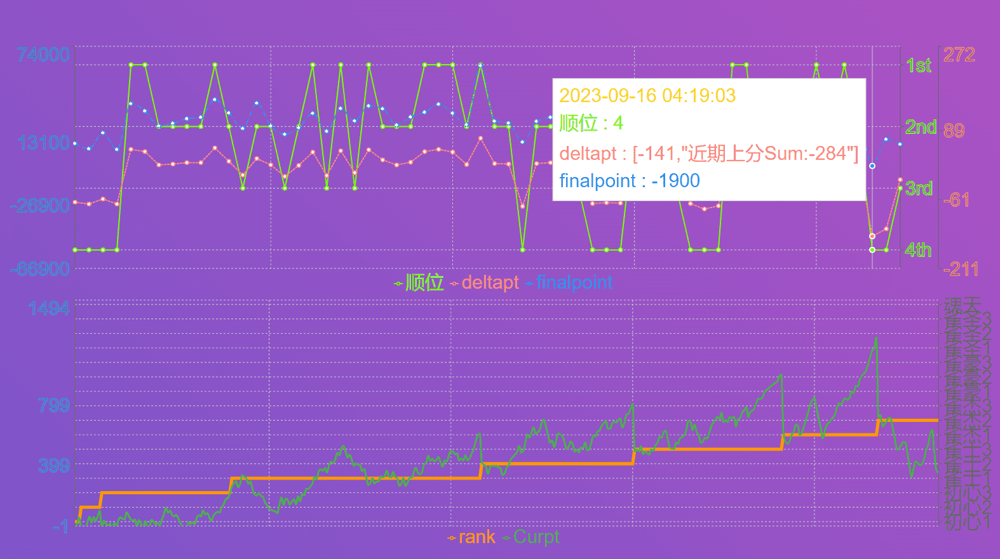
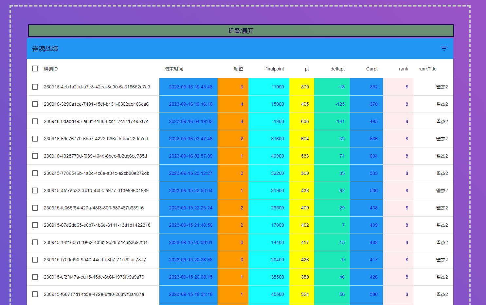

# majSoulRecordPrint
  雀魂战绩数据可视化

## ⭐ Stargazers

Many thanks to the kind individuals who leave a star.
Your support is much appreciated!

## :octocat: 使用方法

- [ ] 运行 - 登录 - 获取牌谱

## :key: 界面

## :gun: 开发者调试环境

Windows: 

- [ ] 使用 python matplotlib scipy csv 生成战绩图表文件
- [ ] 使用 pywebview evaluate_js 开发应用
- [ ] 使用 pipenv Pyinstaller 打包
- [ ] 使用 react webpack 打包静态操作页面
- [ ] 使用 @mui recharts @kunukn/react-collapse 绘制页面战绩图表 
- [ ] 使用 carousel 绘制轮播图 papaparse 解释战绩数据

## :closed_book: 免责声明
该工具为个人制作，未对雀魂代码逻辑进行改动，但是为了获取牌谱数据使用了极少量前端代码的API，包括**获取用户牌谱列表**。所有相关操作代码均在[browseinject.js](assets/browseinject.js)中，工具不会代替用户执行任何其他交互性操作。请自行判断使用该工具的风险。如果使用该工具或（不存在的）该工具的衍生物产生的一切后果作者均不会承担任何责任。

## :art: 致谢

该项目使用或曾经使用了这些项目的资源，感谢他们。

- [雀魂牌谱分析工具](https://github.com/zyr17/MajsoulPaipuAnalyzer)
- [pywebview](https://github.com/r0x0r/pywebview/)

## :poultry_leg: 贡献者

## 开发心路历程

[心得](./doc/心得.md)